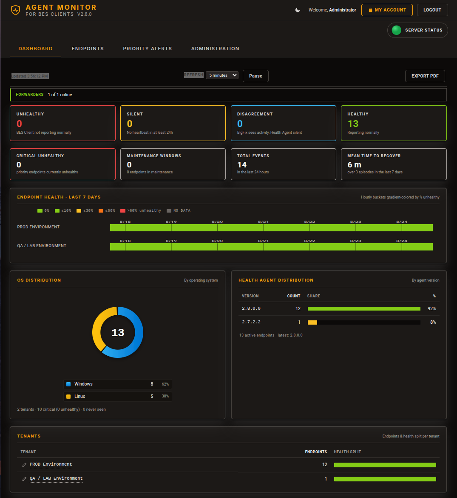
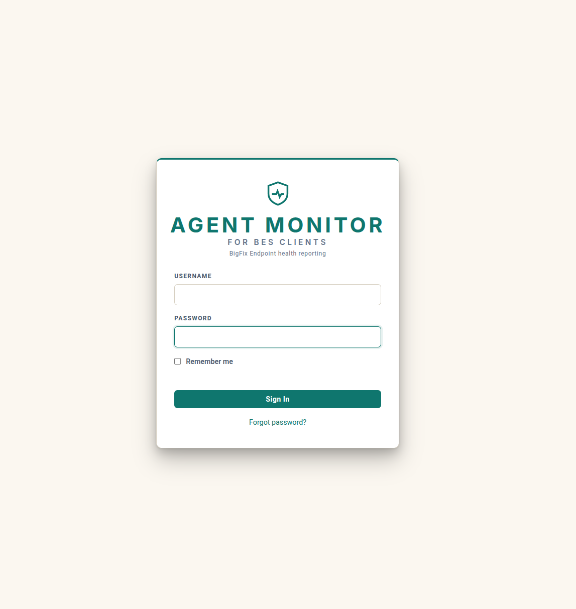
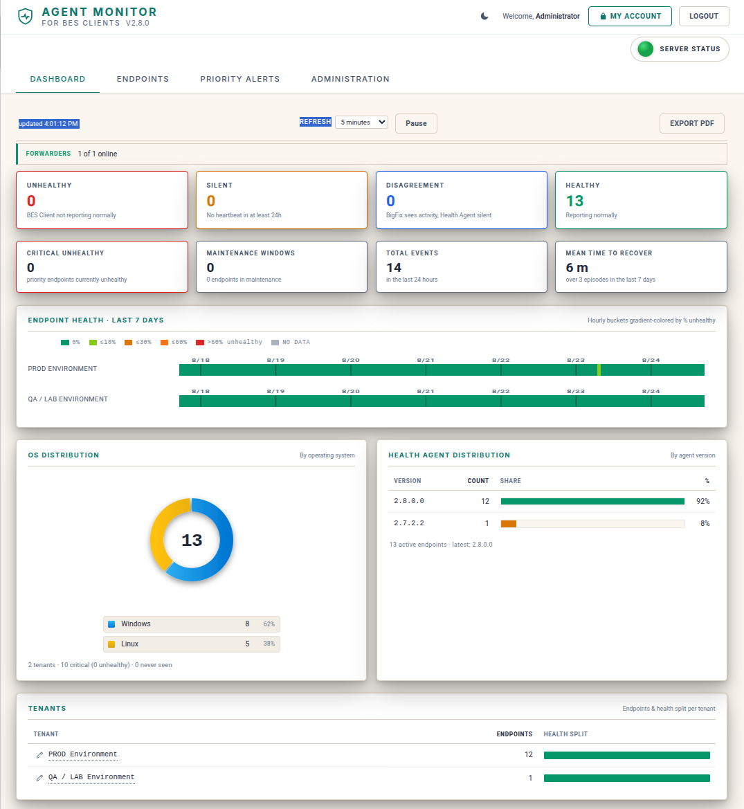
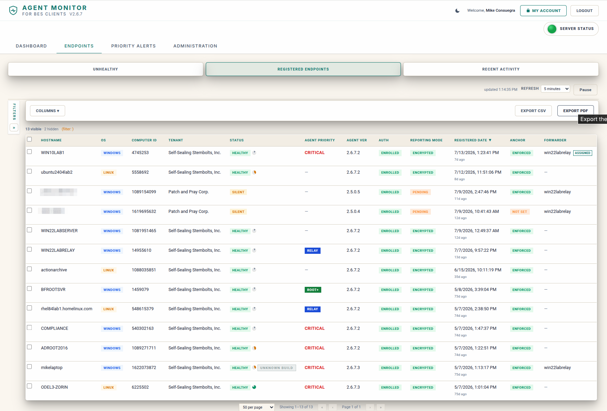
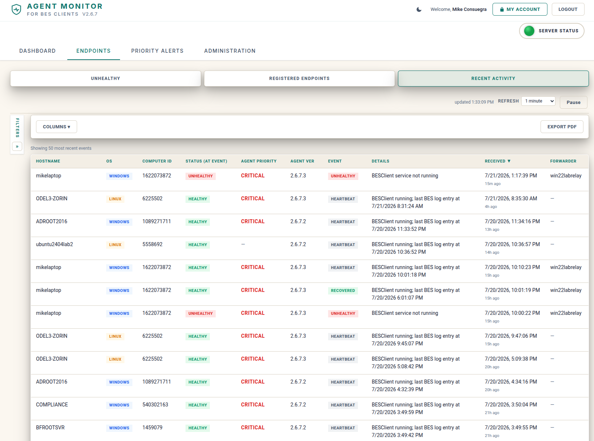
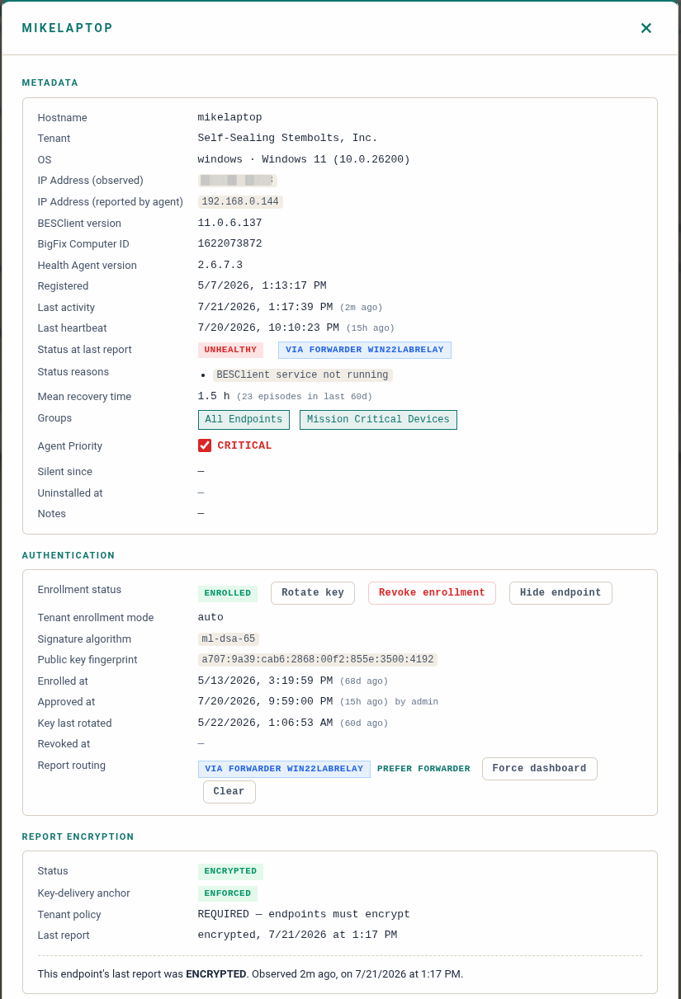
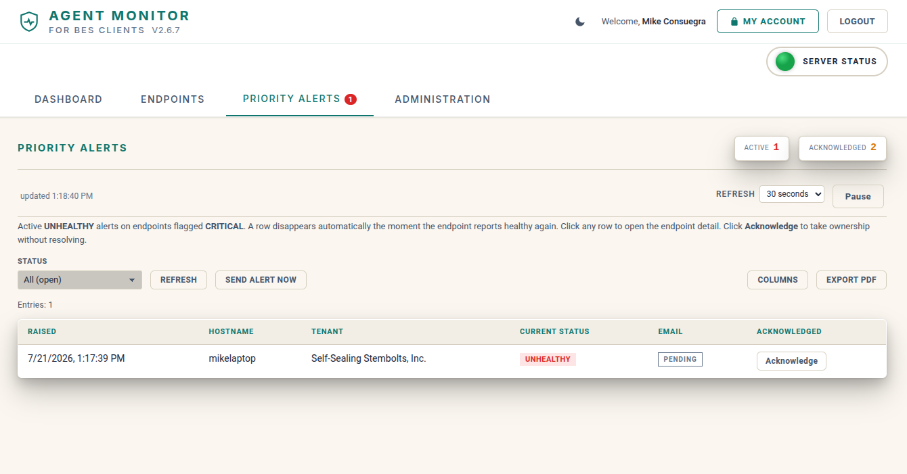
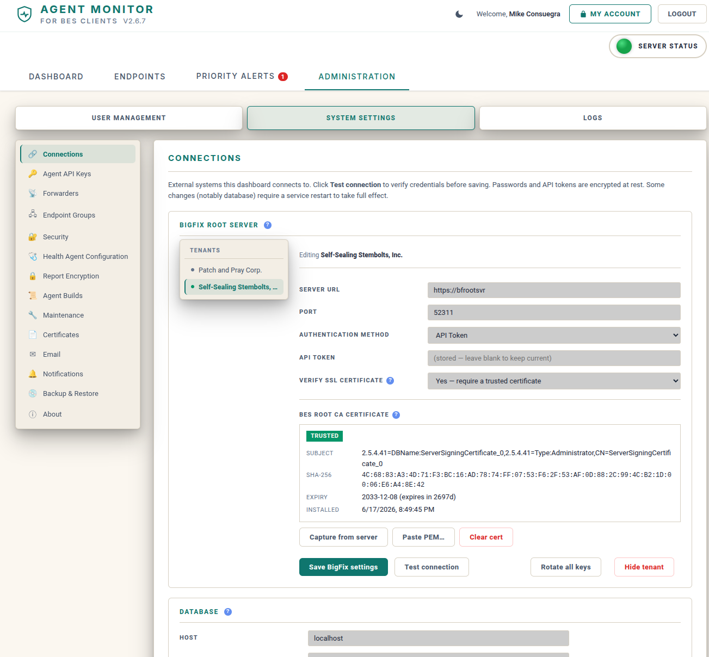
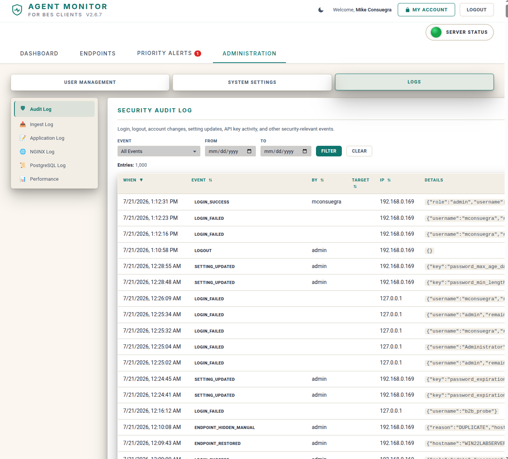
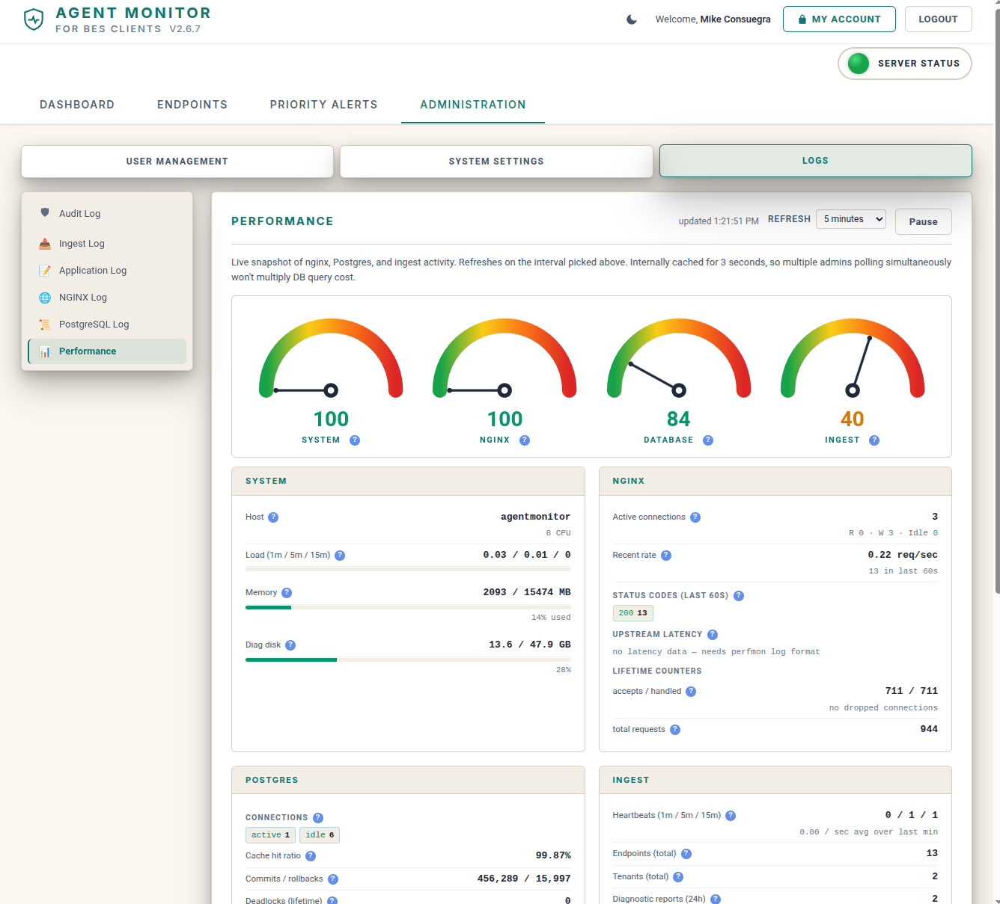

# Agent Monitor for BES Clients

A self-hosted web application that monitors the health of BigFix (BES) client
endpoints out-of-band. A lightweight agent on each endpoint reports
independently of the BES client, so you can tell a genuinely broken client apart
from one that is merely powered off, network-isolated, or just slow to check in.

---

## Why Agent Monitor

In BigFix, much of the intelligence lives on the client. When the BES client
breaks, none of the native BigFix interfaces (Console, Web Reports, WebUI) can
distinguish "broken" from "powered off," "isolated," or "hasn't reported yet";
a missing report is silent by design.

**Agent Monitor** closes that gap with a dedicated out-of-band channel. A small
agent runs on each endpoint, independent of the BES client, and reports to a
self-hosted appliance. The dashboard surfaces two things the BigFix interfaces
cannot:

- **Unhealthy**: the agent's own local checks say the client is broken.
- **Silent**: the agent has stopped reporting, so the endpoint may be down or
  cut off.

It runs alongside your BigFix infrastructure as a self-hosted appliance on a
single Ubuntu server. There are no external dependencies, no cloud services, and
no telemetry.

---

## Key Features

- **Out-of-Band Health Reporting**: An agent on each endpoint reports
  independently of the BES client, so client failures are detected even when
  BigFix itself goes quiet.
- **Heartbeat and Diagnostics**: Every agent run sends a small heartbeat; a
  richer diagnostic bundle is sent only when the endpoint is unhealthy. A missing
  heartbeat is itself a signal.
- **Unhealthy and Silent Views**: The endpoint states the native BigFix
  interfaces cannot distinguish, made first-class on the dashboard.
- **Alerting**: Email alerts when a critical endpoint turns unhealthy, with
  per-group recipients and per-recipient bundling to avoid alert storms.
- **Endpoint Groups and Criticality**: Group endpoints, set criticality, and
  tune self-check intervals and alert routing per group.
- **Cross-Platform Health Agent**: Windows and Linux agents, deployable through
  the BigFix Console.
- **DMZ Forwarder**: Relay agent traffic from isolated network segments to the
  dashboard over a dedicated machine-plane port.
- **Charter-Based Enrollment**: Endpoints enroll against a signed charter with
  per-endpoint keys; enrollment fails closed if the charter cannot be verified.
- **Post-Quantum Signing**: FIPS 204 ML-DSA signatures for build attestation and
  agent reports.
- **Role-Based Access with Tenant Scoping**: Multiple roles, with non-admin
  users scoped to their tenant on a deny-by-default basis.
- **Security Hardening**: Password policies, account lockout, encrypted
  credential storage, TLS by default, and a startup integrity manifest over the
  distributed files.
- **Audit Log**: Full audit trail of administrative actions with CSV and PDF
  export.
- **Backup and Restore**: Database backup and restore from the web interface.
- **Performance and Health Monitoring**: Built-in performance page and a system
  health view covering database, disk, and memory.
- **Dark and Light Themes.**

---

## Screenshots

### Sign In

### Dashboard

### Endpoints

### Recent Activity

### Endpoint Detail

  

### Priority Alerts

### Administration

### Audit Log

### Performance

### Dark Theme

---

## Architecture

Agent Monitor has three components:

1. **Dashboard appliance**: a self-hosted web application on a single Ubuntu
   server (Nginx + Uvicorn + PostgreSQL, managed by systemd).
2. **Health Agent**: a compiled cross-platform agent that runs on each endpoint
   (Windows Scheduled Task, Linux systemd timer), reporting on its own cadence.
3. **DMZ Forwarder** (optional): a relay that forwards agent reports from
   isolated network segments (for example, a DMZ) to the dashboard over the
   machine-plane port.

The operator web interface is served over HTTPS on 443. Agent and forwarder
traffic use a separate, dedicated machine-plane port (tcp/31313), so endpoint
reporting and human web access never share a surface.

| Layer | Technology |
|---|---|
| Backend | Python, FastAPI, SQLAlchemy |
| Database | PostgreSQL |
| Frontend | Vanilla HTML, CSS, JavaScript (no framework) |
| Reverse Proxy | Nginx with TLS 1.2+ |
| Application Server | Uvicorn (single worker, bound to localhost) |
| Process Management | systemd |
| Operating System | Ubuntu Server 24.04 / 26.04 LTS |

The [communication and key-flow diagram](docs/AgentMonitor-Comms-and-Key-Flow.pdf)
walks through the full enrollment, trust, and reporting sequence between BigFix,
the agent, and the dashboard.

---

## Security

Agent Monitor ships with security as a default posture, not an afterthought:

- **Encrypted credential storage**
- **HTTPS by default; dedicated machine-plane port for agents**
- **Signed enrollment charter with per-endpoint keys (fails closed)**
- **Post-quantum (ML-DSA) build attestation and report signing**
- **Startup integrity manifest over distributed files**
- **Hardened file permissions and process isolation**
- **Audit logging**

---

## Releases

The latest release is available on the
[Releases page](https://github.com/mxc0bbn/agent-monitor-besclients/releases).
Each release provides the dashboard installer tarball; agent installers for
Windows and Linux are published alongside it.

**New to Agent Monitor? Start with the
[Quick Start Guide](docs/AgentMonitor-QuickStart-Guide.pdf).** It is a single
page that takes you from the downloaded files to a monitored environment in
eight steps. You do not need to read the full Installation Guide to get going.

The full [Installation Guide](docs/AgentMonitor-Installation-Guide.pdf) (PDF) is
also maintained in [`docs/`](docs/) in this repository for browsing without
downloading a release.

See [CHANGELOG.md](CHANGELOG.md) for a release history summary and
[ACKNOWLEDGMENTS.md](ACKNOWLEDGMENTS.md) for the contributors who have helped
shape the project.

---

## Compatibility

| Component | Tested With |
|---|---|
| BigFix Platform | BigFix Root Server v11.x REST API |
| Dashboard OS | Ubuntu Server 24.04 LTS, 26.04 LTS |
| Endpoint OS (agent) | Windows, Linux |
| PostgreSQL | Installed automatically by the installer |
| Browsers | Chrome, Edge, Firefox |

A BigFix **Master Operator** account is used for the optional cross-reference of
BigFix's own last-report time against the agent's verdict. See the Installation
Guide for setup details.

---

## License

This software is **free to use and freely distributable** in its original,
unmodified form. Modification for commercial sale or distribution is not
permitted. See the [LICENSE](LICENSE) file for the complete terms.

Upstream attribution for open-source components is in
[THIRD-PARTY-LICENSES.md](THIRD-PARTY-LICENSES.md).

---

## Support

For questions, bug reports, or feature requests, please open an issue:
[https://github.com/mxc0bbn/agent-monitor-besclients/issues](https://github.com/mxc0bbn/agent-monitor-besclients/issues)
